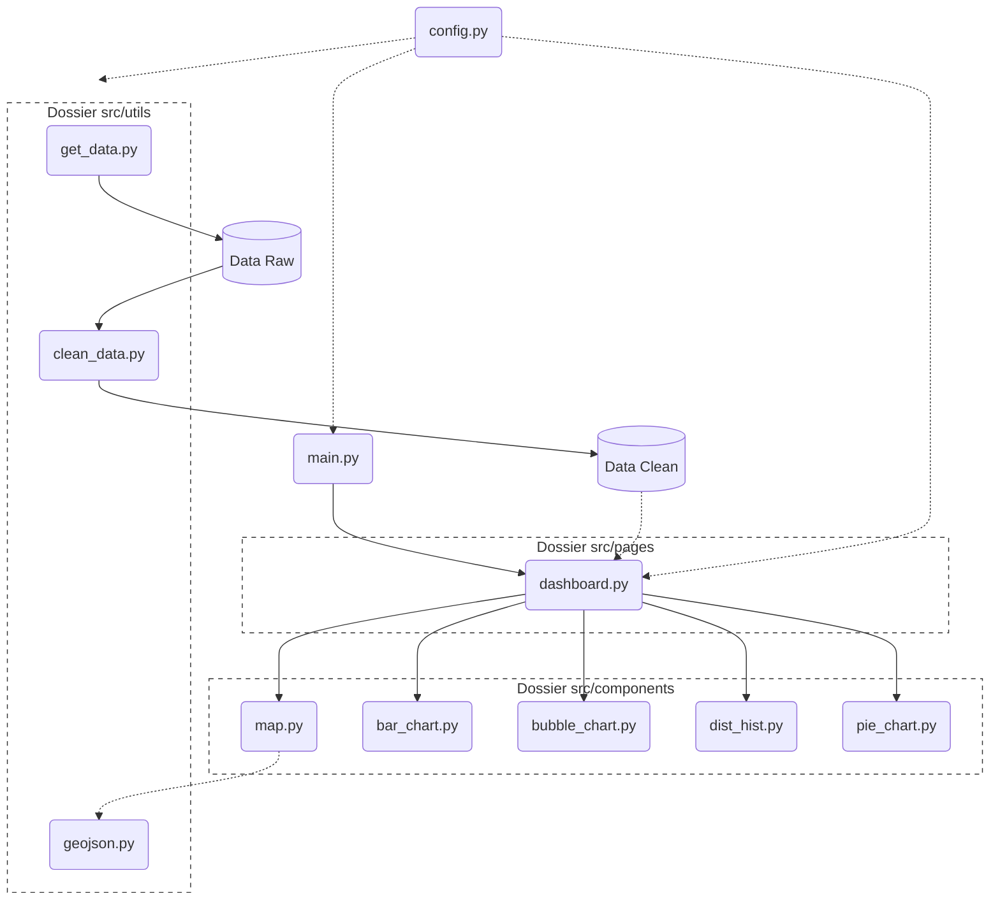

# Visualisation

Ce dépôt GitHub contient le dashboard interactif de visualisation de données.

## User Guide

- **Prérequis**: Python 3.10+ et `pip`.
- **Installation**:

	```bash
      Créer un environnement virtuel :
      - python -m venv .venv

      Activer l\'environnement : 
      - Sur Windows :
        - .venv\Scripts\activate
      - Sur Mac/Linux :
        - source .venv/bin/activate

      Mettre à jour pip et installer les dépendances :
      - pip install --upgrade pip
      - pip install -r requirements.txt
	```

- **Lancer le dashboard** :

   Pour lancer le dashboard, se placer à la racine du projet : 
	```bash
	python main.py
	```

- **Accéder** : ouvrir http://127.0.0.1:8050 dans un navigateur.

- **Déployer sur une autre machine** :
	- Copier le dépôt via un zip ou cloner le repo via la commande : `git clone https://github.com/JulienFernex/Visualisation.git`
	- Reproduire les étapes d'installation ci-dessus.

## Data

Les fichiers de données se trouvent dans le dossier `data` :

- Dans le dossier `data/raw` :
  - `data/raw/raw_data.csv` : données brutes des établissements de santé (proviennent de : https://www.data.gouv.fr/api/1/datasets/r/98f3161f-79ff-4f16-8f6a-6d571a80fea2).
  - `data/raw/raw_data_population.xlsx` : données brutes des populations (proviennent de : https://www.insee.fr/fr/statistiques/fichier/8290591/ensemble.xlsx).
  - `data/raw/departements-avec-outre-mer.geojson` : données geojson utilisées pour la carte (proviennent de : https://raw.githubusercontent.com/gregoiredavid/france-geojson/master/departements-avec-outre-mer.geojson).
- Dans le dossier `data/cleaned`:
  - `data/cleaned/clean_data.csv` : données nettoyées des départements.
  - `data/cleaned/clean_data_commune.csv` : données nettoyées des communes.

Les différents jeux de données contiennent les informations d'établissements (localisation, département, type d'établissement, etc...) ainsi que les données de population. Le fichier `src/utils/clean_data.py` contient la logique de nettoyage des données.

## Developer Guide

Le diagramme suivant illustre la structure de l'application :



Architecture principale :

- `main.py` : point d'entrée qui lance le serveur Dash.
- `config.py` : contient les différentes constantes du projet.
- `src/components/bar_chart.py` : gère la construction du graphique bâton.
- `src/components/bubble_chart.py` : gère la construction du graphique à bulles.
- `src/components/dist_hist.py` : gère la construction de l'histogramme.
- `src/components/map.py` : gère la construction de la carte Folium.
- `src/components/pie_chart.py` : gère la construction du graphique camembert.
- `src/pages/dashboard.py` : gère la conception du serveur dash.
- `src/utils/clean_data.py` : assure le nettoyage des données.
- `src/utils/geojson.py` : charge les données géographiques du geojson.
- `src/utils/get_data.py` : récupère les différentes données raw.

Ajouter un graphique :

1. **Création du composant** : Créer un nouveau fichier dédié dans `src/components/`. Y définir une fonction qui accepte les données souhaitées en arguments et retourne une figure.
2. **Intégration au Layout** : Dans `src/pages/dashboard.py` :
   - Importer la nouvelle fonction.
   - Ajouter un composant `dcc.Graph` (avec un `id` unique) dans `app.layout`, encapsulé dans un `dcc.Loading`.
3. **Mise à jour du Callback** : Toujours dans `src/pages/dashboard.py`, modifier la fonction unique `update_dashboard` :
   - Ajouter un nouvel `Output('nouvel-id', 'figure')` dans la liste du `@app.callback`.
   - Dans la fonction, appeler le générateur : `new_fig = create_new_chart(selected_metric, department=dept)`.
   - Ajouter `new_fig` à la liste des variables retournées par la fonction (`return`).

## Rapport d'analyse

**Principales conclusions :**

- **Volume vs Densité** : Cette visualisation permet de nettement distinguer les zones à forte concentration d'établissements de santé, corrélées aux grands pôles urbains, des zones à forte densité relative d'établissements santé comparativement à leurs populations (métrique du ratio pour 100k habitants). Cette double lecture permet d'identifier plus finement les disparités de couverture territoriale.
- **Maillage territorial** : La visualisation multi-échelles (Département sur la carte et les graphiques vers Commune d'un département donné sur les graphiques) met en évidence que certaines zones rurales, bien que disposant de moins d'établissements en valeur absolue, peuvent présenter un maillage de proximité supérieur à celui de certains pôles urbains, rapporté à leur population.

## Copyright / Déclaration d'originalité

Nous déclarons sur l'honneur que le code fourni a été produit par nous-même, à l'exception des lignes ci-dessous :

- Ligne(s) / groupe(s) de lignes empruntée(s) :
	- Référence de la source : Aucune extraction majeure d'un tiers (seules les différentes documentations des outils ont été utilisées).
     - L'optimisation via l'usage du @lru_cache est basée sur le site : https://realpython.com/lru-cache-python/ 
	- Explication : L'ensemble du projet a été développé en s'appuyant sur la documentation officielle des bibliothèques utilisées (Dash, Pandas, Folium)

Toute ligne non déclarée ci-dessus est réputée être produite par les auteurs du projet. L'absence ou l'omission de déclaration sera considérée comme du plagiat.

**Sources des données :**

Les données exploitées dans ce dashboard sont publiques et proviennent des sources suivantes :

1. **Fichier national des établissements sanitaires et sociaux (FINESS)** :
   - *URL* : https://www.data.gouv.fr/api/1/datasets/r/98f3161f-79ff-4f16-8f6a-6d571a80fea2
   - *Usage* : Source pour la localisation et la catégorisation des établissements.

2. **Population par commune et département (INSEE)** :
   - *URL* : https://www.insee.fr/fr/statistiques/fichier/8290591/ensemble.xlsx
   - *Usage* : Calcul des densités et normalisation des données.

3. **Contours des départements français (GeoJSON)** :
   - *URL* : https://raw.githubusercontent.com/gregoiredavid/france-geojson/master/departements-avec-outre-mer.geojson
   - *Usage* : Fond de carte pour la visualisation choroplèthe via Folium.
